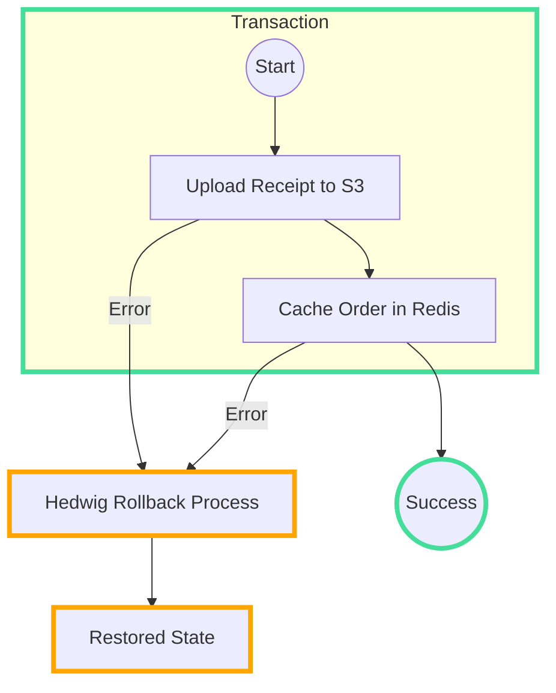

## What is `hedwig`

In modern distributed systems, workflows frequently involve interacting with multiple third-party services like databases, object storage, and caching layers. Each of these services can have their own latency, reliability, and error characteristics, which complicates workflow consistency and data integrity across different parts of a transaction.

`hedwig` is designed to ensure that transactions involving multiple external resources are managed consistently and efficiently. 

## Example

Imagine a workflow where you need to upload a receipt to `S3` and save order details in a `Redis` cache. With `hedwig`, you can manage these operations within a single distributed transaction, ensuring a rollback if any part fails -

